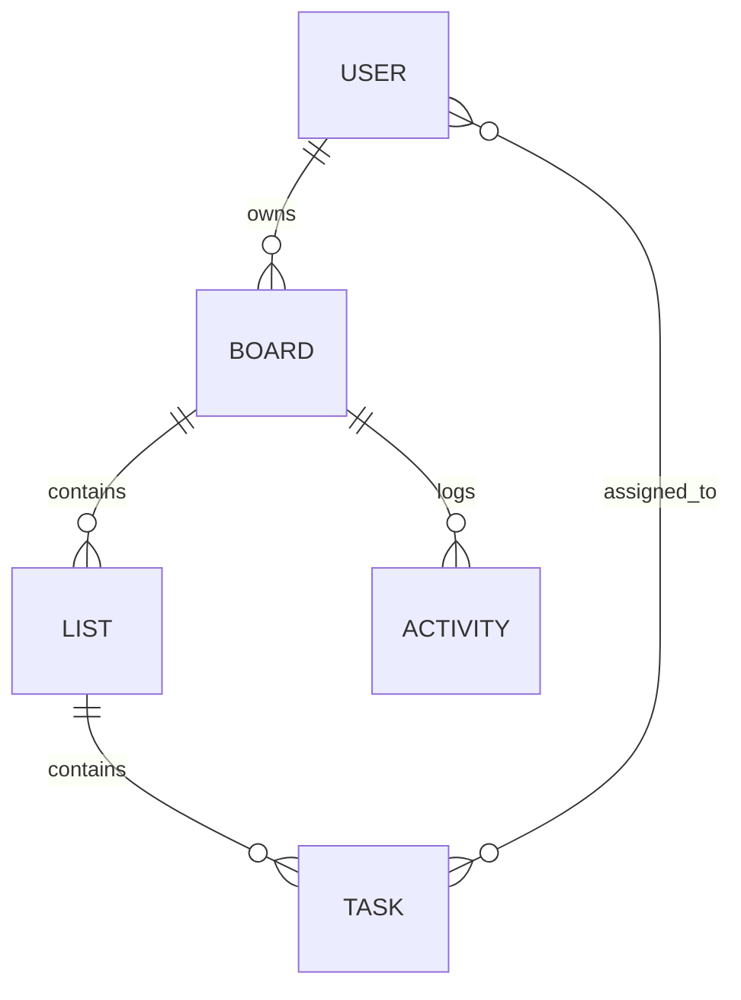

# TaskFlow - Real-Time Task Collaboration Platform

A full-stack collaboration application inspired by Trello/Notion, featuring real-time updates, drag-and-drop task management, and activity tracking.


## 🚀 Features

- **Authentication**: Secure Signup/Login with JWT.
- **Kanban Boards**: Create multiple boards with lists and tasks.
- **Drag & Drop**: Interactive task management across lists.
- **Real-Time Sync**: Instant updates for all board members via Socket.io.
- **Activity History**: Audit log of all board actions.
- **Search**: Fast local filtering of tasks.
- **Responsive Design**: Modern glassmorphism UI with dark mode.

## 🛠️ Tech Stack

### Frontend
- **Framework**: React 18 + Vite
- **Styling**: Vanilla CSS (Custom Design System)
- **State Management**: Context API + useReducer
- **Drag & Drop**: `@dnd-kit` (Accessible, lightweight)
- **Real-Time**: `socket.io-client`

### Backend
- **Runtime**: Node.js
- **Framework**: Express.js
- **Database**: MongoDB + Mongoose (Indexes for performance)
- **Real-Time**: `socket.io`
- **Auth**: `jsonwebtoken` + `bcryptjs`

## 📦 Setup Instructions

1. **Install Dependencies**
   ```bash
   cd server && npm install
   cd client && npm install
   ```

2. **Configure Database**
   - The app uses an **In-Memory Database** by default for instant setup.
   - To use a local MongoDB, start it on port 27017.

3. **Start Application**
   - Run the provided start script (Windows):
     ```bash
     .\start_app.bat
     ```
   - Or run manually:
     ```bash
     # Terminal 1
     cd server && npm run dev
     # Terminal 2
     cd client && npm run dev
     ```

4. **Access App**
   - Open `http://localhost:5173` (or port shown in terminal).
   - **Demo Credentials**:
     - User 1: `alice@demo.com` / `password123`
     - User 2: `bob@demo.com` / `password123`

## 🏗️ Architecture Explanation

### Frontend
- **Component-Based**: Modular architecture with reusable UI components (`TaskCard`, `BoardCard`).
- **Optimistic UI**: State updates immediately on drag-drop, tackling latency.
- **Socket Integration**: Custom `useSocket` hook manages event listeners per board, preventing memory leaks.

### Backend
- **RESTful API**: Structured endpoints for resources (`/api/boards`, `/api/tasks`).
- **Controller-Service Pattern**: Business logic separated from route definitions.
- **Event-Driven**: Controllers emit Socket.io events after successful DB mutations.

### Database Schema



## 🔌 API Contract

| Endpoint | Method | Description |
|----------|--------|-------------|
| `/api/auth/login` | POST | Authenticate user & return JWT |
| `/api/boards` | GET | Fetch user's boards |
| `/api/boards/:id` | GET | Fetch full board data |
| `/api/lists` | POST | Create new list |
| `/api/tasks` | POST | Create new task |
| `/api/tasks/:id/move` | PUT | Update task position/list |

## 📈 Scalability Considerations

1. **Database Indexing**: Indexes on commonly queried fields (`boardId`, `listId`, `position`) ensure fast lookups as data grows.
2. **Socket Rooms**: Broadcasting is scoped to `boardId` rooms, reducing network traffic.
3. **Stateless Auth**: JWTs allow the API to be horizontally scaled behind a load balancer.
4. **Pagination**: Implemented on Boards and Activity endpoints to handle large datasets.
